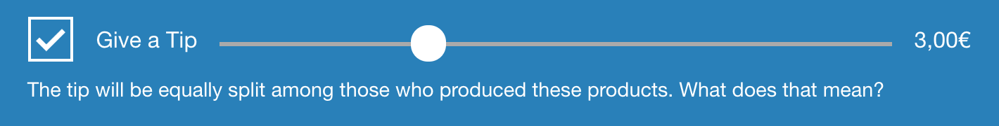

## Integrate the tip banner into your shop

The tip banner asks users to give a tip. It looks like this:

To get started, you can fork the [Ethletic integration](https://github.com/trinkgeld/tip-ui-ethletic). It will be kept up to date by us.

1. Your integration must export a function `init` with the signature `(active, tip) => update`. `init` must check if all requirements are met, e.g. if all subtotal have been sufficiently marked up to be accessed.

2. `update` has the signature `(active, tip) => void`. It is supposed to update/rerender the tip amount and the total appropriately.

3. `init.format` must be a function that takes a price and formats it as a string, according to the shops localization. `init.parse` must be a function that takes a formatted price and parses it, returning a number.

4. `init.css` must be a string of shop-specific CSS. It will be appended to the `<head>` element.

The build script in [`tip-ui`](https://github.com/trinkgeld/tip-ui) will build all integrations specified. Embed `dist/your-integration.min.js` into your shop.

### Troubleshooting

If get into any difficulties, [created an issue in the `tip-ui` repo](https://github.com/trinkgeld/tip-ui/issues) or [contact us](/contact/).
